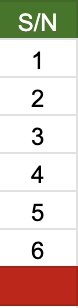

# wdsap-2024-group0

- [Weekly Assignments](#how-to-submit-weekly-assignments)
- [Hackathons](#how-to-submit-hackathons)
- [Project](#how-to-submit-a-project)

# Introduction

- All group repos have been set up with the high-level folders needed for each group.
- When the groups are confirmed, each person will be added to a private repo (with a similar setup to this one) for
  their group.

# Assessment Instructions

## How to Submit Weekly Assignments

NOTE: All the code changes you need to make below will be made to your group's repo, which you should have been invited to by now. If you don't yet have access, speak to a moderator.

These instructions make some assumptions

- they are written as though talking to a specific person
- they assume the name of the question the person is solving
  is [Two Sum](https://leetcode.com/problems/two-sum/description/)
- they assume the question is for week 1
- they assume the language used is Java (so anywhere you see .java, you will replace with the extension of the language
  you actually used)

1. Find the question you should solve
    - Most groups have 6 people. Within a group, each person will own the question aligned with the “S/N” number of
      their row in the group sheet. So, Question 1 → S/N 1, Question 2 → S/N 2 and so on. If a group has 7 people and
      there are 6 questions, the 7th person will solve Question 1. You can view this as a table.
    - | Group Owning S/N | Question Number |
      |------------------|-----------------|
      | 1                | 1               |
      | 2                | 2               |
      | 3                | 3               |
      | 4                | 4               |
      | 5                | 5               |
      | 6                | 6               |
      | 7                | 1               |
    - You can view your S/N on the group sheet
        - 
        - Your number is the "S/N" value on the row you're on
2. Solve the question on Leetcode (or the platform link we provide) and pass as many test cases as you
   can [^test-cases]
3. Create `weekly_assignments/wk1/two_sum/two_sum.java` and copy the code you submitted on Leetcode into it
    - Note that we're in the `wk1` dir because the instructions assume we're in week 1
    - Also note that every question must have its own folder within each week. In this case we have `two_sum`
4. Create `weekly_assignments/wk1/two_sum/two_sum.md` and add the following
    - Add your name, discord username, and leetcode submission link (**take note of the submission format**) at the top of the file
    - Add an explanation for everything the group tried (including what worked, what didn't work, optimizations etc)
    - The file should be formatted like this
      ```
      Solution by: YOUR FULL NAME
      Discord username: YOUR DISCORD USERNAME (as written in the student details sheet)
      Solution: [Submission Link](https://leetcode.com/problems/{problem_name}/submissions/{submission_id}/)
         
      ...
      Your explanation
      ```
5. Push `weekly_assignments/wk1/two_sum/two_sum.java` and `weekly_assignments/wk1/two_sum/two_sum.md` to the repo in a
   commit.
6. Before 6pm WAT on the Friday of Week 1, submit the commit hash that contains all these files to
   this [form](https://bit.ly/wdsapsubmissionform).
    - To get the commit hash, get the url of the last commit (
      e.g. https://github.com/wolfstation/wdsap-2024-group0/commit/ae7d6b51dae8926a966915d8b380b28990601191) and get
      the alphanumeric value after "commit": `ae7d6b51dae8926a966915d8b380b28990601191`
7. If you make another submission on Leetcode and you want to update what you've submitted in the repo, do the following
    - Replace the contents of `weekly_assignments/wk1/two_sum/two_sum.java`
      and `weekly_assignments/wk1/two_sum/two_sum.md` and required
    - Commit
    - Get the new commit hash and submit it on the form
    - You can do this as many times as you want before the deadline (which is Friday by 6pm of every week).
    - Any submissions made after the deadline will not count

9. It is the commit hash a student submits that will be used to score them. Any changes made after the commit
   hash they submitted doesn't count towards the assessment.

Here's an example [demo video](https://drive.google.com/file/d/1O_XeT1EdBabOempcltkmy9IG1_Lp1xal/view?usp=drive_link)

NOTE: Although each person in a group is assigned a question every week, the expectation is that the whole group
collaborates to think through the problem to come up with a solution. This is very important because each question
assigned to a member of a group will affect the group's overall score [^grading].

[^test-cases]: You don't have to get all the testcases to submit your assignment, simply do your best
[^grading]: We'll explain how grading works soon

## How to Submit Hackathons

- Hackathon questions will be provided on hackerrank
- Hackathon submissions have 2 components: a team component & an individual component

### Team Component

1. The team should collaborate on all questions given in the hackathon
2. One person in the team should submit all the solutions for a team. To put another way, each team should have just one
   submission in the hackathon from one person. The person who does this is up to the team.
3. Make sure you submit before the hackathon deadline

### Individual Component

TL;DR: Each person in the team must pick one of the problems and submit an explanation of the approach the team took (
including what worked, what didn't work, optimizations)

1. We'll let you know closer to the time who within a group should submit the explanation for a question, but it'll be
   very similar to how we get the question assignments
   under [how to submit weekly assignments](#how-to-submit-weekly-assignments). The only difference is that the set of
   questions you're considering is the set of hackathon questions on hackerrank and the ordering of the question
   determines the number.
2. Assuming the question you're assigned by the formula is TwoSum and this is the first hackathon in the program, then
   create `hackathon/hack1/two_sum.md` and add the following
    - Add your name and discord username at the top of the file
    - Add an explanation for everything the group tried (including what worked, what didn't work, optimizations etc)
    - The file should be formatted like this
      ```
      Solution by: YOUR FULL NAME
      Discord username: YOUR DISCORD USERNAME (as written in the student details sheet)
      Solution: [Submission Link](HTTP://LINK TO SUBMISSION)
         
      ...
      Include the following details
      - Your approach(es). If you had just one approach, please say that explicitly
      - The time and space complexity of each approach
      ```
3. Follow steps 5-7 of [how to submit weekly assignments](#how-to-submit-weekly-assignments) , but consider the
   following
    - The file in question here is `hackathon/hack1/two_sum.md`
    - The deadline will be communicated on the hackathon page

## How to Submit a Project

1. Add the project code to the `project` dir
2. Commit the project code
3. Before the deadline of the project, submit the commit hash that contains all the files to
   this [form](https://bit.ly/wdsapsubmissionform).
    - To get the commit hash, get the url of the last commit (
      e.g. https://github.com/wolfstation/wdsap-2024-group0/commit/ae7d6b51dae8926a966915d8b380b28990601191) and get
      the alphanumeric value after "commit": `ae7d6b51dae8926a966915d8b380b28990601191`

Note the following:

- Groups can set up their project within the `project` dir however they choose but the project should be runnable
  locally
- Before the deadline for submitting projects, the team will submit a hash. During the demo, the team will build their
  projects from that hash and we will use that for the assessment
- The whole team should collaborate for this project. We may ask questions from anyone on the team during the demo

# Relevant Links

- [Create markdown tables](https://www.tablesgenerator.com/markdown_tables)
- [Generate gitignore files](https://www.toptal.com/developers/gitignore/)
