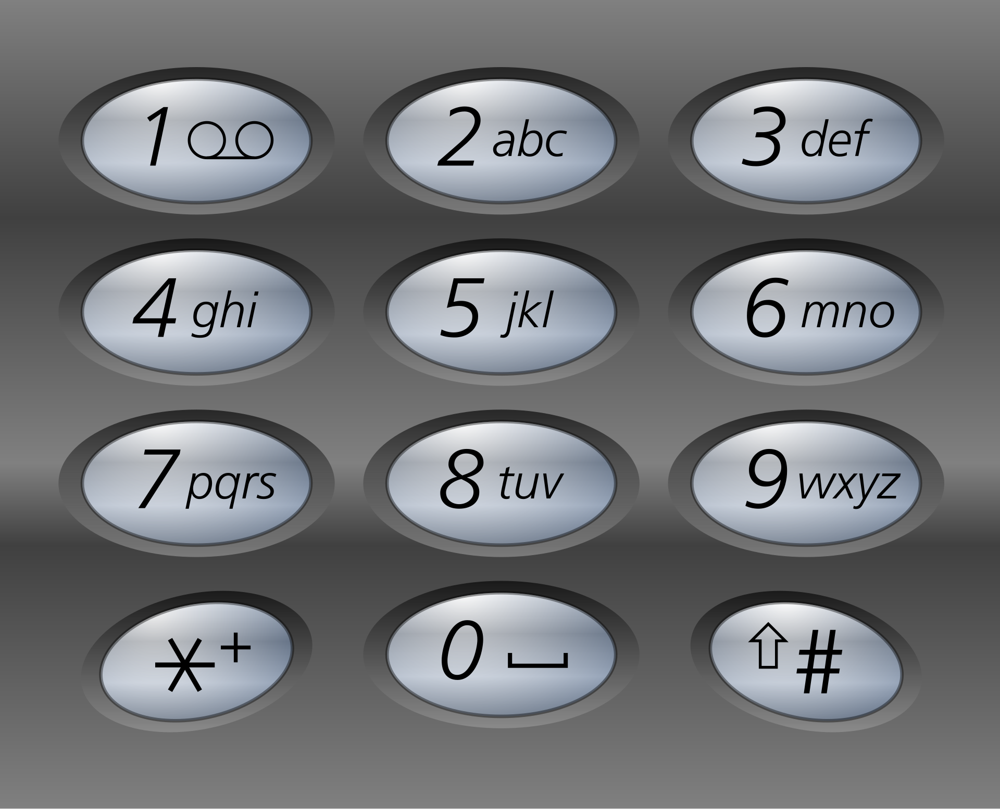

# Contact List Lookup System

Develop a contact list lookup system that displays a list of names from a contact list based on numeric input, based on
the keypad of old mobile phones.

As an initial example, if a user clicks "2", the system should match names that start with "a", "b" or "c". If a user
clicks "23", the system should match names that start with either of the following: "ad", "ae", "af", "bd", "be", "bf",
"cd", "ce", "cf". You get the gist. So depending on the combination of characters chosen, the system should match names
that start with all possible combinations of characters assigned to each typed number.

So to re-summarize: When a user enters a sequence of numbers, the system interprets these numbers as potential
combinations of letters and fetches matching contact names.

The system should allow users do the following:

- Upload a list of contacts
    - the input format is a list of comma separated values (see sample_contact.txt)
    - users should be able to upload the TXT file from the UI (design a suitable interface with HTML & CSS)
- Click on numbers & see the clicked numbers
    - design an interface similar to the image above
    - the only numbers that should be clickable is from 2 to 9
    - each key should correspond or the same collection of letters as seen above (2-->abc, 3-->def, etc)
    - the numbers that are clicked on the UI should be displayed (e.g. if "2", "9" and "6" are clicked, 296 should be
      shown somewhere on the UI)
- See a configurable list of matched names based on the numbers entered
    - after the numbers are entered, a list of matched names should be display on the UI
    - the list of displayed names should be configurable (e.g. we should be able to say that we want only 4 matched
      names)
    - the displayed names should be lexicographically ordered
    - display results **dynamically** as numbers are entered or modified.

## Examples

### Examples 1

**Contact List:** ["alex", "james", "lily", "oliver", "emma", "noah", "ava", "ethan", "mia", "lucas", "sophia", "
liam", "amelia", "mason", "harper", "logan", "ella", "jackson", "scarlett", "aiden", "grace", "sebastian", "zoe", "
elijah", "chloe", "matthew", "isla", "daniel", "hannah", "benjamin", "samuel", "ella", "jack", "isabella", "michael", "
aria", "henry", "riley", "leo", "nora", "jacob", "luna", "william", "savannah", "jayden", "ellie", "gabriel", "
stella", "owen", "violet", “lamia"]

**Search pattern:** "52"

**Expected Result:** ["jack", "jackson", "jacob", "james", "jayden", "lamia"]

### Example 2

**Contact List:** ["dima", "tom", "alice", "vlad", "williams", "jason"]

**Search pattern:** "10"

**Expected Result:** []

### Example 3

**Contact List:** ["alex", "james", "lily", "oliver", "emma", "noah", "ava", "ethan", "mia", "lucas", "sophia", "
liam", "amelia", "mason", "harper", "logan", "ella", "jackson", "scarlett", "aiden", "grace", "sebastian", "zoe", "
elijah", "chloe", "matthew", "isla", "daniel", "hannah", "benjamin", "samuel", "ella", "jack", "isabella", "michael", "
aria", "henry", "riley", "leo", "nora", "jacob", "luna", "william", "savannah", "jayden", "ellie", "gabriel", "
stella", "owen", "violet", "ryan", "zoey", "dylan", "nina", "austin", "ivy", "carter", "hazel", "jason", "maya", "
blake", "bella", "caleb", "aurora", "nathan", "leah", "connor", "piper", "brandon", "ruby", "xavier", "eva", "kevin", "
lucy", "isaac", "claire", "tyler", "melanie", "adrian", "paisley", "jordan", "alice", "cole", "sienna", "parker", "
audrey", "joshua", "skylar", "christopher", "julia", "landon", "sadie", "gavin", "autumn", "julian", "willow", "
nicholas", "mila", "aiden", "alyssa"]

**Search pattern:** "5"

**Expected Result:** ["jack", "jackson", "jacob", "james", "jason", "jayden", "jordan", "joshua", "julia", "julian", "
kevin", "landon", "leah", "leo", "liam", "lily", "logan", "lucas", "lucy", "luna"]

## Constraints:

- The maximum length for contact names is 21 characters
- Support a minimum of 500 contacts
- 0, 1, * and # should not map to any letters
- Implement the user interface using HTML and CSS for layout and styling
- The UI should handle real-time input, updating the displayed contact names as users press different keys on the
  keypad
- Assume that each name in the contact list is unique

## Some Important Notes

- In this project, you are expected to handwrite your own data structures and algorithms for every thing
    - The only exception to this is using arrays in static languages or lists in dynamic languages
    - The spirit of the projects to is help you implement your own version of the data structures you need -- please do
      not violate the spirit of the project
    - If you are unsure about whether to use an in-built structure or method, please ask
- Do not use vulgar or obscene language anywhere in this project (or program). This applies to comments, variables,
  function names, commit messages...everything. If violated, the team earns an automatic zero.
- Your code should not only solve the problem, but it should also be written clearly and with good programming style.
    - Remove dead code from your codebase
    - Write tests
    - Structure the project properly
    - Use a style checker to ensure proper formatting
    - Errors should be intelligible (we should be able to tell what the issue is, and how to fix it)
- Each team member must contribute substantially (i.e. commit code) to the project to partake in the full marks of their
  team.
- Your code should be easy to build on locally for a demo
- Apart from the code that will deliver these features, you are to write a report that details
    - The approaches the team considered and what influenced the chosen approach
    - The challenges faced implementing
    - Time complexity & space complexity of each function
- You can use any language (or combination of languages) to build your project.
    - Some languages provide UI support, feel free to use them if they meet the needs here.
    - You can build a UI that talks to a backend via APIs
    - You can build within just the JS ecosystem
    - and so on (ask if you have questions)
    - Do not use word press (or anything similar).
- We care about the efficiency of your solution, so the more efficient, the better. But the most important thing is to
  solve the problem.